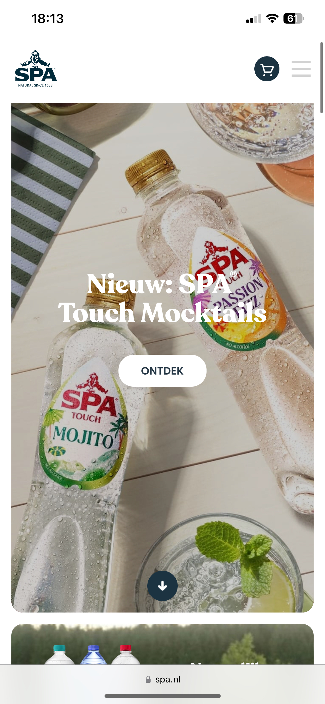
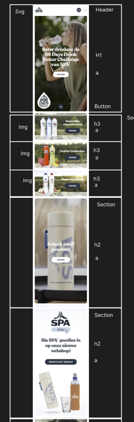
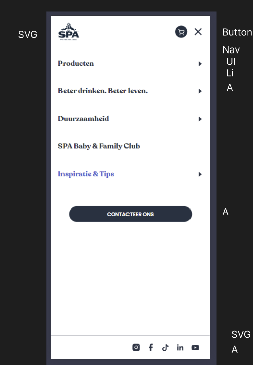
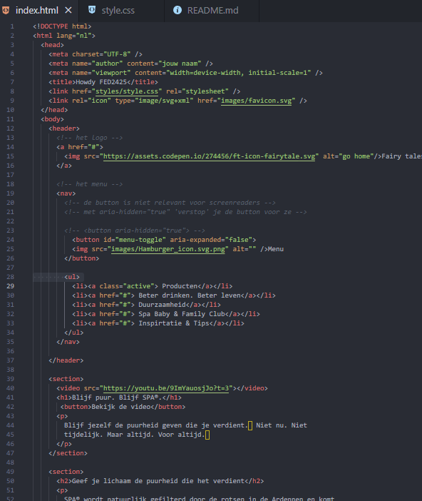

# Procesverslag

Markdown is een simpele manier om HTML te schrijven.  
Markdown cheat cheet: [Hulp bij het schrijven van Markdown](https://github.com/adam-p/markdown-here/wiki/Markdown-Cheatsheet).

Nb. De standaardstructuur en de spartaanse opmaak van de README.md zijn helemaal prima. Het gaat om de inhoud van je procesverslag. Besteedt de tijd voor pracht en praal aan je website.

Nb. Door _open_ toe te voegen aan een _details_ element kun je deze standaard open zetten. Fijn om dat steeds voor de relevante stuk(ken) te doen.

## Jij

  
uitwerken voor kick-off werkgroep

### Auteur:

Randi Berkelaar

#### Je startniveau:

Rood

#### Je focus:

Responsive

## Je website

  
uitwerken voor kick-off werkgroep

### Je opdracht:

https://www.spa.nl/

#### Screenshot(s) van de eerste pagina (small screen):

Home pagina

#### Screenshot(s) van de tweede pagina (small screen):

Tips & Inspiratie pagina

## Toegankelijkheidstest 1/2 (week 1)

  
uitwerken na test in 2e werkgroep

### Bevindingen

Lijst met je bevindingen die in de test naar voren kwamen:

-De website van Spa is oke toegankelijk. Veel heb ik kunnen afvinken met de WCAG checklist.
-De overige dingen die niet goed waren ga ik zelf verbeteren.

## Breakdownschets (week 1)

  
uitwerken na afloop 3e werkgroep

### de hele pagina:

  

### dynamisch deel (bijv menu):

  

### wellicht nog een dynamisch deel (bijv filter):

Nvt

  <!--  -->

## Voortgang 1 (week 2)

  
uitwerken voor 1e voortgang

### Stand van zaken

hier dit ging goed & dit was lastig (neem ook screenshots op van delen van je website en code)

-Alle html op de pagina zetten ging goed daar was niet zo veel aan.

-De css daar in tegen is wel tricky. Ik ben nu nog bezig met de header wat al redelijk gaat met behulp van de oefen opdrachten en chatgpt.

### Agenda voor meeting

samen met je groepje opstellen

| Randi          | Joep               | Nienke         | Lois                        |
| -------------- | ------------------ | -------------- | --------------------------- |
| dit bespreken  | en dit             | en ik dit      | en dan ik dat               |
| en dat ook nog | dit als er tijd is | nog een punt   | dit wil ik zeker            |
| Mijn html code | Grid               | Hamburger menu | Fonts & bg video downloaden |

### Verslag van meeting

hier na afloop snel de uitkomsten van de meeting vastleggen

- punt 1: Ik heb door Chatgpt paar foutjes gemaakt
- punt 2: Meer zelf gaan coderen

## Voortgang 2 (week 3)

  
uitwerken voor 2e voortgang

### Stand van zaken

hier dit ging goed & dit was lastig (neem ook screenshots op van delen van je website en code)

-Met behulp van de header opdracht heb ik de header na kunnen maken grotendeels

-Fontface lukte niet om mijn font er op te krijgen

### Agenda voor meeting

samen met je groepje opstellen

| Randi       | Joep               | lois         | Nienke           |
| ----------- | ------------------ | ------------ | ---------------- |
|             | en dit             | en ik dit    | en dan ik dat    |
|             | dit als er tijd is | nog een punt | dit wil ik zeker |
| Font family | gradient op tekst  | font family  |

### Verslag van meeting

hier na afloop snel de uitkomsten van de meeting vastleggen

- punt 1: Font family probleem opgelost
- punt 2: Ik moet de header prioriteit geven
- punt 3: beginnen aan de footer
- punt 4: html zag er wel goed uit met paar verbeter puntjes
- punt 5: Via inspect bij netwerk kan ik foto's en dergelijke opslaan

## Toegankelijkheidstest 2/2 (week 4)

  
uitwerken na test in 9e werkgroep

### Bevindingen

Lijst met je bevindingen die in de test naar voren kwamen (geef ook aan wat er verbeterd is):

-Op mijn website kan je goed naar alle headings navigeren wat niet kan bij de offical spa website

## Voortgang 3 (week 4)

  
uitwerken voor 3e voortgang

### Stand van zaken

hier dit ging goed & dit was lastig (neem ook screenshots op van delen van je website en code)

-Alles responsive maken ging goed
-Bugs oplossen goed

-Footer was lastig

### Agenda voor meeting

samen met je groepje opstellen

| Randi          | Joep               | Nienke       | Lois             |
| -------------- | ------------------ | ------------ | ---------------- |
| dit bespreken  | en dit             | en ik dit    | en dan ik dat    |
| en dat ook nog | dit als er tijd is | nog een punt | dit wil ik zeker |
| Button svg     |
| die responsive |

### Verslag van meeting

hier na afloop snel de uitkomsten van de meeting vastleggen

- Ik heb nog wat divs en classes in m'n html
- Het ziet er al wel goed uit
- Bron vermelding overal doen
- Moet dingen kunnen uitleggen
- 2e pagina beginnen

## Eindgesprek (week 5)

  
uitwerken voor eindgesprek

### Je uitkomst - karakteristiek screenshots:

  

### Dit ging goed/Heb ik geleerd:

Minder divs en classes gebruiken
Darkmode
Screenreader gebruiken
Css selectors
Focus stijlen

  

### Dit was lastig/Is niet gelukt:

-De footer responsive maken voor desktop ik moet hem eigenlijk opnieuw doen
-De lange sectie van een ondergrondse reis

  

## Bronnenlijst

  
continu bijhouden terwijl je werkt

Nb. Wees specifiek ('css-tricks' als bron is bijv. niet specifiek genoeg).
Nb. ChatGpT en andere AI horen er ook bij.
Nb. Vermeld de bronnen ook in je code.

1. ChatGpt prompts
2. Opdrachten van Sanne
3. Content en styling van Spa

